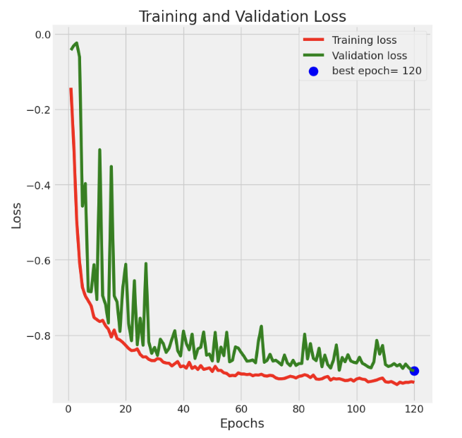
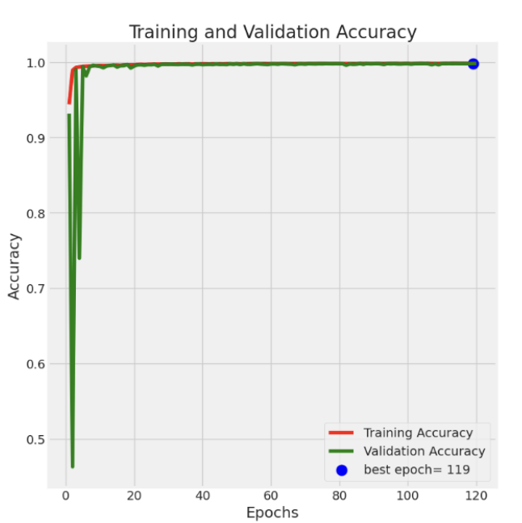
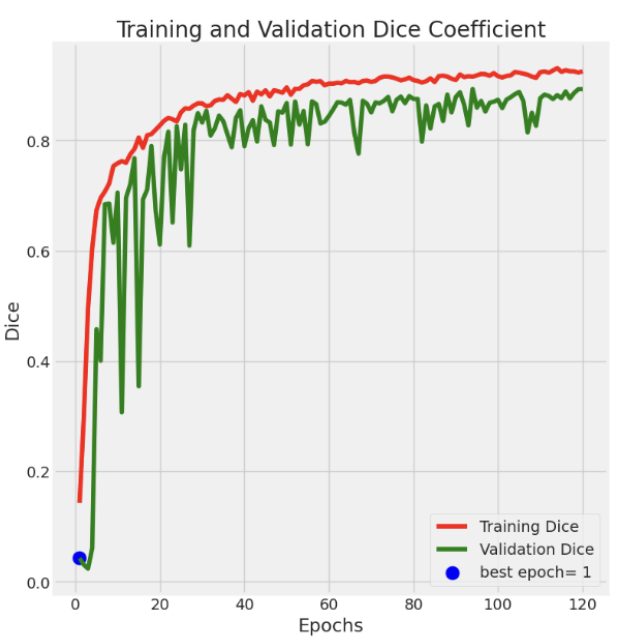
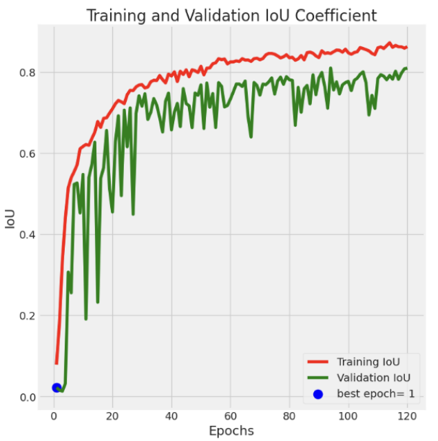

# Brain Tumor Segmentation Using U-Net

Abstract—Accurate segmentation of brain tumors from MRI
images is a crucial step in the diagnosis and treatment of brain
cancer. This project employs a U-Net based Convolutional Neural
Network (CNN) to perform brain tumor segmentation of the data
of 110 patients. The proposed model demonstrates high accuracy
and efficiency in delineating tumor regions from multimodal MRI
images, contributing to improved diagnostic support systems.
Index Terms—Brain tumor segmentation, U-Net, deep learning, MRI, medical image processing, LGG Segmentation Dataset.

##  Project Overview

Lower-grade gliomas (LGGs) are a heterogeneous group of
primary brain tumors characterized by varying genetic profiles
and clinical outcomes. Accurate and automated segmentation
of LGGs in brain magnetic resonance imaging (MRI) is crucial
for diagnosis, treatment planning, and monitoring disease
progression. Manual segmentation, although widely used, is
time-consuming and subject to inter-observer variability. To
address these challenges, deep learning-based approaches have
gained popularity due to their high accuracy and efficiency. In
this work, we focus on brain tumor segmentation using the
LGG Segmentation Dataset, which includes brain MR images
and corresponding manually annotated FLAIR abnormality
masks. The dataset was obtained from The Cancer Imaging
Archive (TCIA) and corresponds to 110 patients from The
Cancer Genome Atlas (TCGA) LGG collection. All included
patients have available fluid-attenuated inversion recovery
(FLAIR) sequences and genomic cluster information, which is
summarized in the accompanying data.csv file, For segmentation, we employed the U-Net architecture, a widely adopted
convolutional neural network (CNN) model for biomedical
image segmentation tasks. U-Net is particularly effective for
learning from relatively small medical datasets, as it leverages
skip connections to capture both local and global features in
an image, enabling precise delineation of tumor regions. This
study aims to automate LGG tumor segmentation and explore
the model’s performance on clinical MRI scans using this
established dataset.

- **Dataset:** 110 patient cases with FLAIR MRI images and corresponding ground truth masks.
- **Architecture:** U-Net (original implementation)
- **Loss Function:** Dice Loss
- **Optimizer:** Adamax
- **Metrics Used:** Dice Coefficient, Intersection over Union (IoU), Accuracy
- **Best Results:**
  - Dice Coefficient: 0.913
  - IoU: 0.841
  - Accuracy: 0.998

## Methodology

1. **Data Preprocessing**:
   - Normalization and resizing of FLAIR MRI images
   - Data augmentation: rotation, flipping, scaling

2. **Model Architecture**:
   - Contracting path with convolution + ReLU + max-pooling
   - Expansive path with transposed convolution and skip connections
   - Sigmoid output for binary segmentation mask

3. **Training Details**:
   - Loss Function: Dice Loss, Maximizes overlap between predicted and actual tumor masks.
   - Optimizer: Adamax (lr=0.001)
   - Loss Function: Dice Loss
   - Epochs: 119 (early stopping)

4. **Evaluation**:
   - Dice Coefficient: Measures similarity between predicted and ground truth masks
   - IoU (Jaccard Index): Assesses segmentation overlap
   - Accuracy: Less informative for segmentation tasks, but reported for completeness

## Results

The model achieved high segmentation performance on the validation dataset with excellent generalization and minimal false positives.

| Metric           | Value  |
|------------------|--------|
| Dice Coefficient | 0.913  |
| IoU              | 0.841  |
| Accuracy         | 0.998  | 

  
  
  
  

## 📚 References

- Ronneberger et al. "U-Net: Convolutional Networks for Biomedical Image Segmentation", MICCAI 2015.
- The Cancer Imaging Archive (TCIA) - TCGA-LGG Dataset
- M. Buda et al., 2019; M.A. Mazurowski et al., 2017

---

